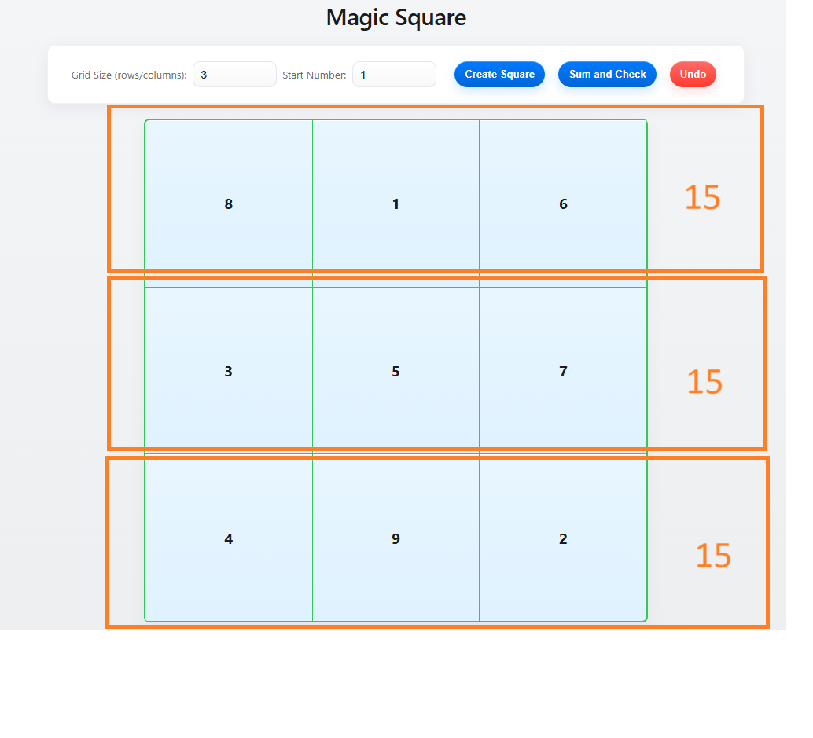
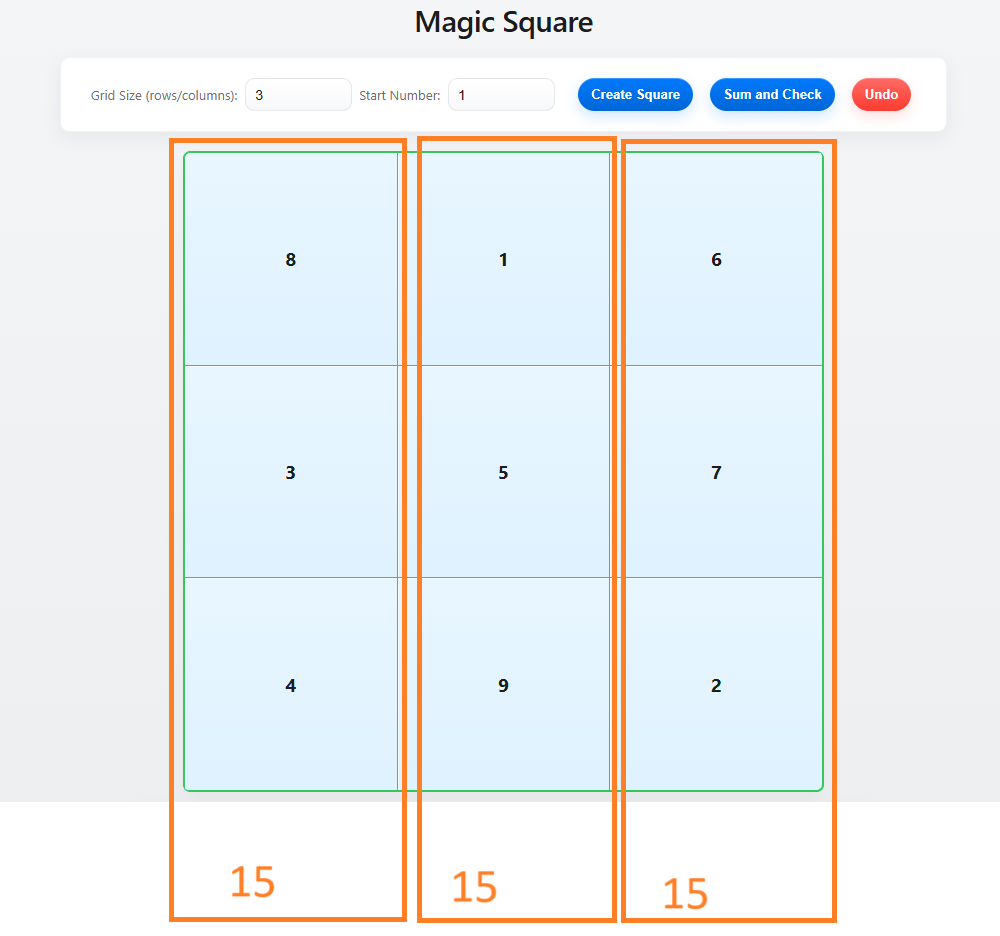
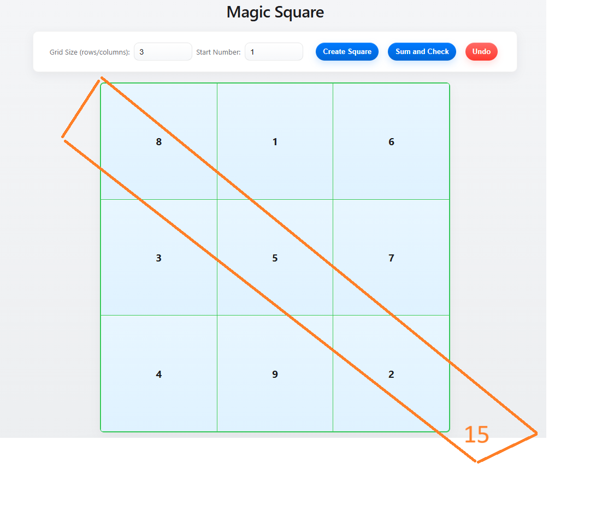
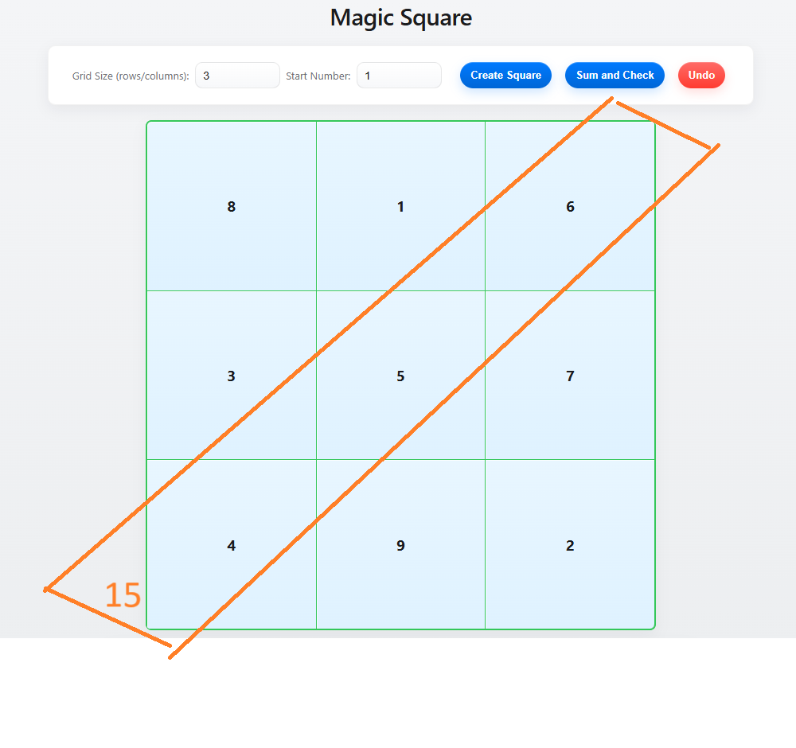

# Magic Square

A responsive single-page web app (HTML, CSS, Vanilla JS) for creating square grids, filling cells sequentially, calculating sums and checking whether the grid is a magic square.

This README has been updated to reflect recent UI and behavior changes.

## Highlights / What changed

- Apple-like theme: improved UI styling for inputs, buttons and cards (subtle gradients, rounded controls).
- Visible green grid borders: grid separators and outer border are always visible (1px green separators).
- Stable cell hover/fill: hover/fill styles use inset effects (no shifting) so separators stay visible.
- Sum & Check: "Sum and Check" button computes row/column/diagonal sums and checks if all sums match.
  - Shows a status chip: "Success" or "Failure".
  - Status chip is displayed to the right of the diagonal section and aligned vertically with the first column sum value.
  - Failure styling is clearly red; Success styling is green.
- Results layout:
  - Row sums and Column sums shown as chips.
  - Diagonal sums shown as chips and aligned to match column/row chips.
  - Results panel scrolls into view and receives focus when sums are computed (accessibility).
- Undo: multi-step undo restores last fill and hides results to reflect changes.
- Accessibility & UX:
  - Smooth scroll to results, focus management, aria-live on results area.
  - Responsive layout; single-column results on small screens.

## Features

- Dynamic grid creation (1–10) with configurable start number.
- Click empty cells to fill sequential numbers (starts from chosen start number).
- "Sum and Check" calculates:
  - Row sums (chips)
  - Column sums (chips)
  - Main and anti-diagonal sums (chips)
  - Global check: all sums equal → Success, otherwise Failure.
- Multi-step Undo (stack-based).
- No external libraries — pure HTML/CSS/Vanilla JS.

## How to use

1. Open `MagicSquare.html` in a modern browser.
2. Enter grid size and starting number.
3. Click "Create Square".
4. Click empty cells to fill them (numbers increment automatically).
5. Click "Sum and Check" to compute sums and display Success/Failure.
   - The status text appears to the right of diagonals and is aligned with the first column sum.
6. Use "Undo" to remove last filled cell(s); results hide after undo.

Ex: 3X3 Magic Square . The sums of the numbers in each row, each column, and both main diagonals are equal.

## Notes for developers

- Main script lives inside the `<script>` block in `MagicSquare.html`.
  - Key functions: `createGrid()`, `calculateSums()`, `undoLast()`.
  - DOM APIs used: `createElement`, `classList`, `textContent`, `innerHTML`, `getBoundingClientRect`, `scrollIntoView`, `focus`, `requestAnimationFrame`.
- Styles are in the `<style>` block in `MagicSquare.html`. Grid separators use CSS Grid `gap: 1px` + container background color to draw separators.
- Status alignment uses runtime measurements to vertically align the success/failure chip with the first column chip.

## License

MIT — see LICENSE.
